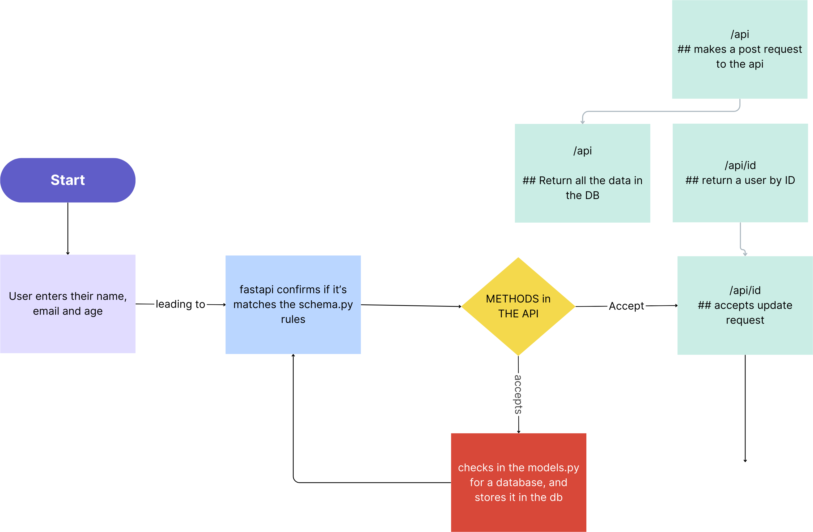

# hng-stage2




## Steps on how to run the project
Considering that you're on a unix or linux based machine, follow the prompt below to run the project locally

- Public hosted url 
``` https://stage2.up.railway.app ```

- ``` make sure python is installed [>3.9.1] ```
 
 make sure python is installed on your system, and atleast a version greater than 3.9

- ``` make sure python venv is also installed ```

 this package would enable us to run our code in a virtual environment, with that out of the way, let's proceed to the main fun

 // how to run the project
 - ``` python3 -m venv env && source env/bin/activate```
  this will help us to create a virtual environment in same folder . dir and also activate it

 - ``` pip install -r requirements.txt ```
 this will enable us to install the necessary dependecies like uvicorn, fastapi etc

 - ``` uvicorn main:app ```
 this command to run our python fastapi app using the uvicorn lib, and give us a local host url to visit 

 - ``` http://127.0.0.1:8000 ```
 visit the url for instance and access the application


### Extra features in the app
 considering the fact that the app is built on fastapi, it comes with swagger docs off the hook, try visiting the following routes to interact with the docs

 ``` http://127.0.0.1:8000/docs ```

 and 

 ``` http://127.0.0.1:8000/redoc ```


#### contact for futher corrections, bugs or suggestions
Email: peter@linkedtrust.us
Gmail: benjaminparish6@gmail.com
